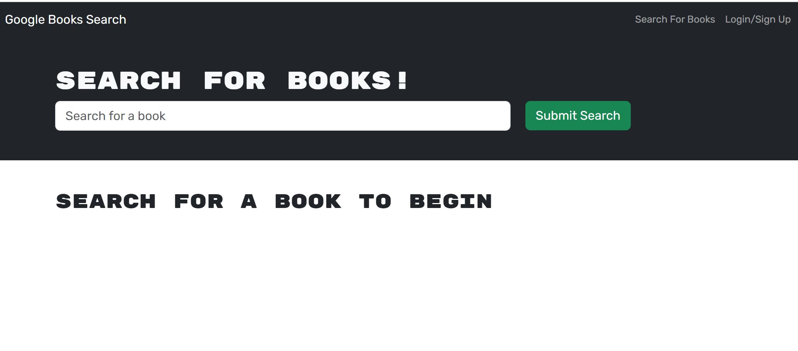
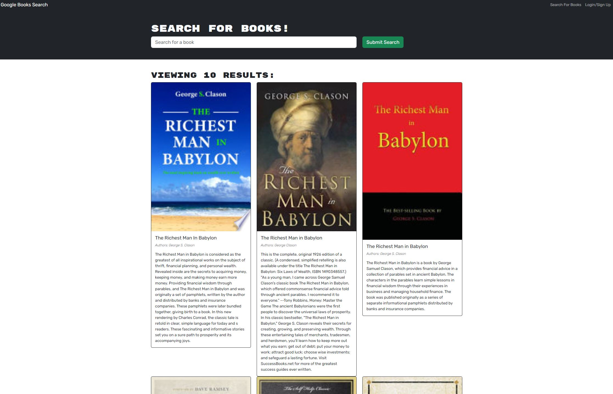

# 21 - Book Search Engine - MERN

[](https://opensource.org/licenses/MIT)

## Description
In this week's Challenge I used a starter code with a fully functioning Google Books API search engine built with a RESTful API, and refactored it to be a GraphQL API built with Apollo Server. The app was built using the MERN stack with a React front end, MongoDB database, and Node.js/Express.js server and API. It's already set up to allow users to save book searches to the back end. 

The inspiration behind this project is emblematic of the fact that most modern websites are driven by two things: data and user demands. This shouldn't come as a surprise, as the ability to personalize user data is the cornerstone of real-world web development today. And as user demands evolve, applications need to be more performant.

You will deploy this full-stack application to Heroku

## Table of Contents
- [User-Story](#user-story)
- [Acceptance-Criteria](#acceptance-criteria)
- [Installation](#installation)
- [Usage](#usage)
- [License](#license)
- [Contributing](#contributing)
- [Test](#test)
- [Questions](#questions)

## User-Story

```
AS AN avid reader
I WANT to search for new books to read
SO THAT I can keep a list of books to purchase
```


## Acceptance-Criteria

```
GIVEN a book search engine
WHEN I load the search engine
THEN I am presented with a menu with the options Search for Books and Login/Signup and an input field to search for books and a submit button
WHEN I click on the Search for Books menu option
THEN I am presented with an input field to search for books and a submit button
WHEN I am not logged in and enter a search term in the input field and click the submit button
THEN I am presented with several search results, each featuring a book’s title, author, description, image, and a link to that book on the Google Books site
WHEN I click on the Login/Signup menu option
THEN a modal appears on the screen with a toggle between the option to log in or sign up
WHEN the toggle is set to Signup
THEN I am presented with three inputs for a username, an email address, and a password, and a signup button
WHEN the toggle is set to Login
THEN I am presented with two inputs for an email address and a password and login button
WHEN I enter a valid email address and create a password and click on the signup button
THEN my user account is created and I am logged in to the site
WHEN I enter my account’s email address and password and click on the login button
THEN I the modal closes and I am logged in to the site
WHEN I am logged in to the site
THEN the menu options change to Search for Books, an option to see my saved books, and Logout
WHEN I am logged in and enter a search term in the input field and click the submit button
THEN I am presented with several search results, each featuring a book’s title, author, description, image, and a link to that book on the Google Books site and a button to save a book to my account
WHEN I click on the Save button on a book
THEN that book’s information is saved to my account
WHEN I click on the option to see my saved books
THEN I am presented with all of the books I have saved to my account, each featuring the book’s title, author, description, image, and a link to that book on the Google Books site and a button to remove a book from my account
WHEN I click on the Remove button on a book
THEN that book is deleted from my saved books list
WHEN I click on the Logout button
THEN I am logged out of the site and presented with a menu with the options Search for Books and Login/Signup and an input field to search for books and a submit button 
```

## Installation
To get the app running, simply head on over to the deployed link on Heroku.


## Usage
This app allows the user to ...

here are the images of the application on local host:




## License
This app is covered under MIT license. For details and limitations of this license please visit:
[License Link for MIT](https://opensource.org/licenses/MIT)


## Contributing
If you would like to share your feedback and/or contribute your best practices to make our code better, feel free to get in touch with us via:
  GitHub: [21-book-search-engine-MERN - link](https://github.com/dinozio-design/21-book-search-engine-MERN)<br>

## Test
We are using jest for testing the development of the functions. No test have been written for this application yet.
<br>

## Questions
If you have any questions, you can email them to me.
  email: <sam@dinozio.design><br>

### Deployed Links

1. You can find the deployed application on Heroku **here:** <br>
[Google Book Search](https://intense-headland-35424-320404f76292.herokuapp.com/)<br>


2. You can find the URL of my GitHub repository that contains this code **here:** <br>[GitHub Repo - link](https://github.com/dinozio-design/21-book-search-engine-MERN)

### Authors Notes: 
  _This README and accompanying repo have been brought to you by:_<br>© Sam Azimi - 2023 CodeCamp Studen.<br>Confidential and Proprietary. All Rights Reserved.